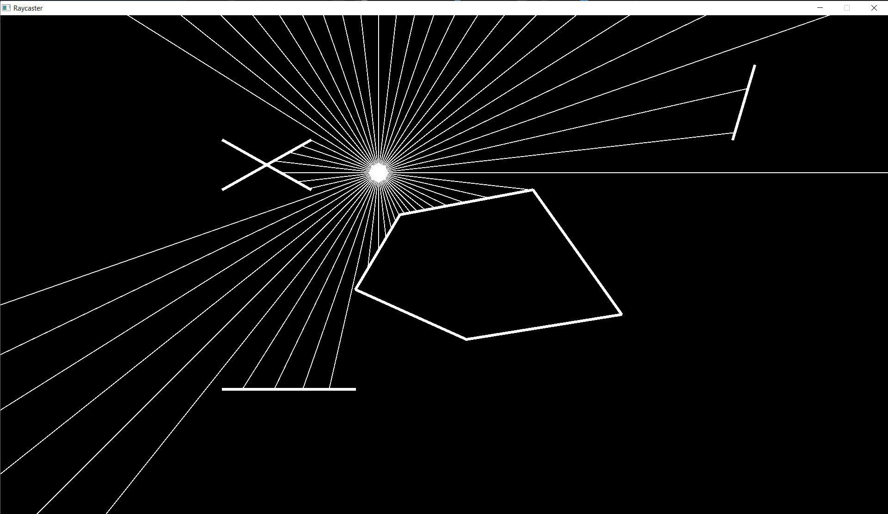
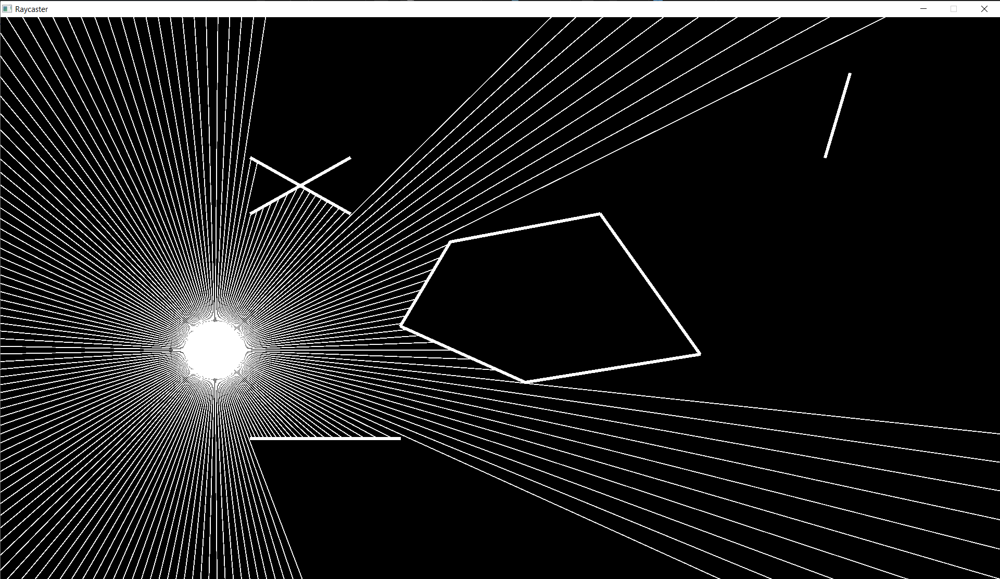
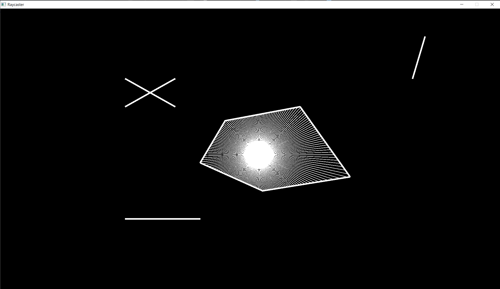

# About
A 2D ray casting demo. Essentially an exercise in geometry and GLFW/OpenGL.

The idea for this demo came from this YouTube video: https://www.youtube.com/watch?v=TOEi6T2mtHo, though all code in this repository is my own.

The mouse scrollwheel controls the number of rays to be cast.

